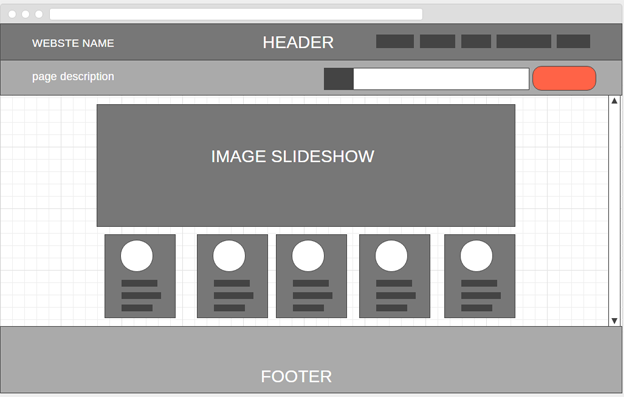
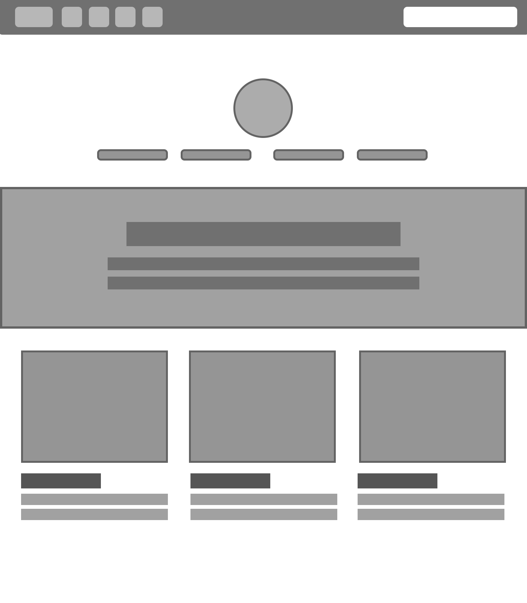
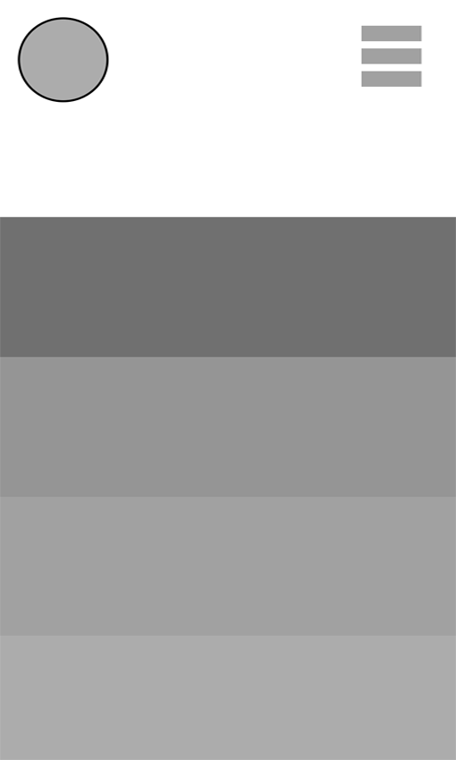
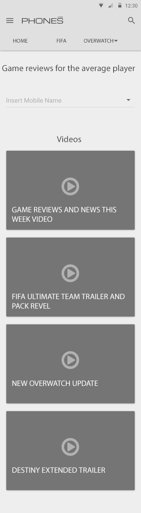

<h1>P14155058</h1>

For the second assignment for CTEC3905 I have decided to construct a game review website which uses the fundamentals of HTML5, CSS3 and Javascript. GITHUB will be used to show progess of my work by commiting as much as i can.
 

<h1>Commit history</h1>

<h2>first commit</h2>

first commit is to test the github account has been set up and working properly with the hello world inserted

<h2>second commit</h2> 

added folders and the index and sytle page to github
 

<h2>Third commit </h2> 

The header and footer have been constructed, the footer displays font awsome icons for the represented social media website and the header includes the responsive navigation bar for the next commit will be moving onto the main body of each website page
 

<h2>fourth commit</h2>

adds the image slideshow with the use of javascript to make it automatic and tried to adjust the mobile navigation. section tags will be used throughtout most of the website as it provide efficient spacing between every part of the website pages
 

<h2>fifth commit</h2> 

finished homepage by adding minor content to page by sectioning the images and the text
 

<h2>sixth commit</h2> 

 Added in the video using the simple video tags for the overwatch page while creating characterb profile and images

<h2>seventh commit</h2> 

In this commit the overwatch page of the website has been completed, with the character profiles linking the the offical overwatch page itself. A tilt animation is also present. Work on the fifa page has started with the football icons utilzing a spin animation 

<h2>Eighth commit</h2> 

Finished fifa icons which use a -360 degree animation with basic "a herf" links which have been optimized using CSS3 by changing border sizes, padding and colour scheme. 
  

<h2>Nineth commit</h2>

 The text has been added for the destiny page which will later be edited with the css, an aside section will also be implemented on this page to show the full effect of html5

<h2>Tenth commit</h2>

 The aside section has be added to the "destiny" page with an form element for users to submit requests regarding reviews, for the next commit i will be using iframe elements to embed youtube videos instead of using an actual video tag. Along side this a google maps API function will be added for third party features

<h2> Eleventh commit</h2>

 In this commit the google maps API has been added to the homepage and has been made responsive to fit the screen at all times, however it does not any advanced features such as a set point on the map. It was created by using javascript but did not become functionally until an API key was obtained from the google developers website. Other development that was made in this commit was iframe videos from youtube being added to the "destiny" page. For the next commit the social media buttons that were added earlier will all link to their respected websites. 

<h2>Twelfth commit</h2>

The footer links have been adjusted to suit the selected icon on each page. For the next commits the intial designs with be added to this README.md file 

 <h1>Wireframes/Intial Designs</h1>
 
 
The images and diagrams below are the design I constructed online for how i wanted my to look like. These include a number of wireframes that show what the designs look like on a computer, tablet and a phone

 
 
 <h3> Homepage designs</h3>
  
 
 
 
 
The two images of the homepage are designs that were first considered for the look of the website. These were the most important as the homepage sets the tone for the rest of the website

 
 <h3>Mobile Responsive design</h3>
 
 
 
 
the first image is a simplified look at how the mobile view of the website would look like and the imahe beneth is a more detailed look at the page and all its contents, this is subject to chage as development goes on

 <h3>Tablet view</h3>
 
 
 